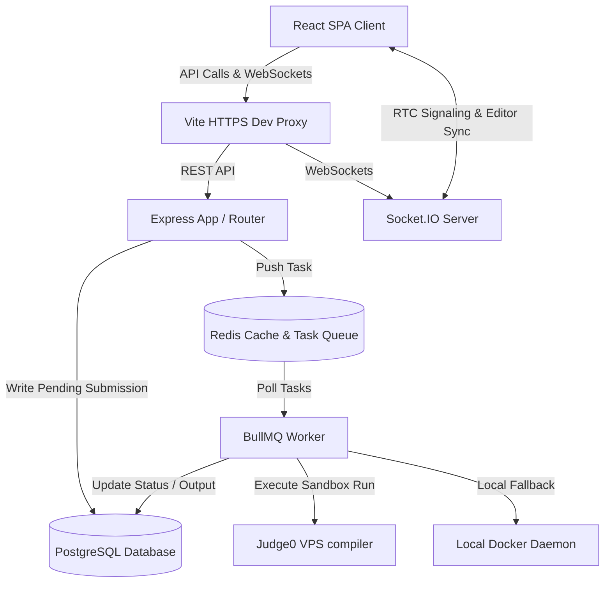

# InterVue Onboarding Technical Brief 🚀

Act as a senior engineer onboarding onto the InterVue codebase for the first time. This document provides a complete technical analysis of the application's overview, architecture, components, database structure, APIs, security/authentication, engineering tradeoffs, external integrations, configuration, testing strategy, and critical open risks.

---

## 1. Project Overview

### What the Application Does
InterVue is a premium technical interviewing and candidate assessment platform. It serves two primary workflows:
1. **Live Interview Sessions**: Allows HR administrators to schedule live, collaborative coding rounds. Candidates and interviewers pair-program in real-time inside a shared code editor, complete with built-in WebRTC video chat overlays and interactive question progression.
2. **Online Assessments (OAs)**: Facilitates timed, anti-cheat guarded exams for candidates. Candidates write code against test cases in an isolated, secure sandbox environment, while their focus, window size, and full-screen state are strictly monitored.

### Problem Solved & Target Users
*   **The Problem**: standard technical interviews suffer from poor pair-programming tooling, lack of secure isolated runtimes for custom code evaluation, or cumbersome setups for timed test invigilation.
*   **Target Users**:
    *   **HR / Recruiter Administrators**: Schedule interviews, create assessments, enroll candidates, and view exam statuses.
    *   **Interviewers / Technical Evaluators**: Select coding/MCQ/scenario questions from a bank, coordinate live pair-coding sessions, and review candidate submissions.
    *   **Candidates (Interviewees)**: Complete live interviews and timed assessments.

### Technical Stack & Rationale
*   **Frontend (React + Vite)**:
    *   *React*: Chosen for modular component structures, which are vital for rendering dynamic layouts like the [InterviewDetail](file:///c:/Projects/INTERVUE/frontend/src/pages/InterviewDetail.jsx) collaborative page.
    *   *Vite*: Chosen for rapid hot-module reloading (HMR) and fast build processes.
    *   *Monaco Editor (`@monaco-editor/react`)*: Standard for high-fidelity code editing, bringing VS-Code features (syntax highlighting, indentation) directly to candidate assessment fields.
    *   *Socket.io-client*: Enables bi-directional, real-time message exchange for collaborative typing synchronization and signaling.
    *   *Axios*: Configured with custom interceptors to handle token rotation transparently.
*   **Backend (Node.js + Express.js)**:
    *   Asynchronous event loop execution model maps well to high-concurrency real-time WebSocket rooms and background worker queuing.
*   **Database (PostgreSQL + Prisma ORM)**:
    *   *PostgreSQL*: Relational engine handles structural integrity for complex associations (e.g. a candidate linked to an assessment, which links to questions, which have answers).
    *   *Prisma*: Provides type-safe database queries and automated SQL schema migrations.
*   **Task Queuing & Caching (Redis + BullMQ)**:
    *   *BullMQ*: Manages asynchronous, non-blocking execution of user code submissions.
    *   *Redis*: Backs the BullMQ task queues and stores Express query caches.
*   **Code Sandbox (Docker / Judge0 API)**:
    *   *Judge0 API (VPS)*: Handles secure code execution by compiling candidate submissions on isolated cloud sandboxes.
    *   *Local Docker Daemon fallback*: Spawns CPU and memory-limited containers if the Judge0 service is offline or reports cgroups incompatibility.

---

## 2. Architecture

### High-Level Architecture
InterVue implements a **monolithic backend architecture with a decoupled React SPA frontend**.
*   The Express server processes REST API routes, maintains active WebSocket pools via Socket.IO, and runs the BullMQ background worker inside the same process space (optional decoupled separation exists).
*   State is stored in a relational PostgreSQL database and cached in Redis.
*   The system uses an asynchronous worker pattern for compiling candidate solutions: the API server drops a task in a Redis queue and responds with `202 Accepted`, while workers pick it up and update the database with results.



### Folder Structure
*   [backend/prisma/schema.prisma](file:///c:/Projects/INTERVUE/backend/prisma/schema.prisma): Relational database models and enums.
*   [backend/src/app.js](file:///c:/Projects/INTERVUE/backend/src/app.js): Application bootstrap, registering custom cookie-parsing, CORS, authentication routes rate-limiters, API endpoints, and worker/websocket linkages.
*   [backend/src/socket.js](file:///c:/Projects/INTERVUE/backend/src/socket.js): WebSocket event handlers for video signaling (WebRTC) and live room membership.
*   [backend/src/worker.js](file:///c:/Projects/INTERVUE/backend/src/worker.js): Background worker executing jobs using sandboxes and recording output in the DB.
*   [backend/src/controllers/](file:///c:/Projects/INTERVUE/backend/src/controllers/): Handles core request-response processing (e.g. `login`, `signup`, `interviews`, `assessments`, `questions`).
*   [backend/src/middleware/](file:///c:/Projects/INTERVUE/backend/src/middleware/): Houses token authentication, role validation, ownership checking, and schedule duration checks.
*   [backend/src/services/](file:///c:/Projects/INTERVUE/backend/src/services/): Sandbox executions ([sandbox.js](file:///c:/Projects/INTERVUE/backend/src/services/sandbox.js)), Redis queue pushes ([queue.js](file:///c:/Projects/INTERVUE/backend/src/services/queue.js)), and email/OTP triggers.
*   [frontend/src/context/](file:///c:/Projects/INTERVUE/frontend/src/context/): React global contexts for auth states ([AuthContext.jsx](file:///c:/Projects/INTERVUE/frontend/src/context/AuthContext.jsx)) and sockets ([SocketContext.jsx](file:///c:/Projects/INTERVUE/frontend/src/context/SocketContext.jsx)).
*   [frontend/src/components/](file:///c:/Projects/INTERVUE/frontend/src/components/): UI components, including the WebRTC client wrapper [VideoChat.jsx](file:///c:/Projects/INTERVUE/frontend/src/components/VideoChat/VideoChat.jsx) and the Monaco-integrated [QuestionRunner.jsx](file:///c:/Projects/INTERVUE/frontend/src/components/QuestionRunner/QuestionRunner.jsx).

### Request Lifecycle
Taking code execution as an example, a request flows as follows:
1.  **Frontend trigger**: The candidate presses "Run Code" in [QuestionRunner.jsx](file:///c:/Projects/INTERVUE/frontend/src/components/QuestionRunner/QuestionRunner.jsx#L85-L132).
2.  **API Dispatch**: The client sends a `POST` request to `/api/submissions` via the Axios instance defined in [api.js](file:///c:/Projects/INTERVUE/frontend/src/services/api.js#L37).
3.  **Vite Proxy**: The request reaches Vite's dev server which proxies it to `http://localhost:3000` (retaining HTTPS session flags, see [vite.config.js](file:///c:/Projects/INTERVUE/frontend/vite.config.js#L12-L21)).
4.  **Security Middleware**: In [app.js](file:///c:/Projects/INTERVUE/backend/src/app.js#L55), the request passes through `authenticateToken` in [middleware/auth.js](file:///c:/Projects/INTERVUE/backend/src/middleware/auth.js) to decode the user's role and id, followed by `checkStatus` in [middleware/checkStatus.js](file:///c:/Projects/INTERVUE/backend/src/middleware/checkStatus.js) to verify the account is active.
5.  **Controller Action**: `submitCodeForExecution` in [controllers/submission.js](file:///c:/Projects/INTERVUE/backend/src/controllers/submission.js#L4-L34) creates a `Submission` record in PostgreSQL with status `PENDING`.
6.  **Queue Injection**: The controller calls `addCodeExecutionJob` in [services/queue.js](file:///c:/Projects/INTERVUE/backend/src/services/queue.js#L28-L44), pushing the job variables to the Redis queue.
7.  **HTTP Response**: The controller sends a `202 Accepted` status back to the client along with the `submissionId`.
8.  **Background Processing**: The BullMQ `Worker` in [worker.js](file:///c:/Projects/INTERVUE/backend/src/worker.js#L8-L74) detects the Redis entry, updates DB status to `RUNNING`, and executes the code via `runInSandbox` in [services/sandbox.js](file:///c:/Projects/INTERVUE/backend/src/services/sandbox.js#L211).
9.  **Compilation & Sandbox Execution**: `runInSandbox` attempts to post the code to the remote Judge0 VPS. If that fails or times out, it falls back to launching a local Docker container with arguments (`--network none`, `--memory 256m`, `--cpus 1.0`) to run the script.
10. **Result Saving**: The worker writes stdout/stderr/error, execution time, and completion status (`COMPLETED`, `FAILED`, or `TIMEOUT`) back to Postgres.
11. **Polling Loop**: In the meantime, the client polls `GET /api/submissions/:id` once per second. When the status changes from `RUNNING` or `PENDING`, the poll returns the output.

### Key Design Patterns
*   **Model-View-Controller (MVC)**: Express routing decouples routing definition from controller logic.
*   **Service Layer**: Encapsulates external domains (e.g. Redis queues, execution sandboxes, mailers) away from direct controller routing.
*   **Axios Interceptor Queue / Token Refresh Pattern**: Implemented in [AuthContext.jsx](file:///c:/Projects/INTERVUE/frontend/src/context/AuthContext.jsx#L35-L76). Standard interceptors intercept `401 Unauthorized` errors, buffer requests into a queue, request a rotated token via `/api/refresh-token`, and replay the failed requests.
*   **WebRTC Signaling & Room Pattern**: Uses Socket.IO rooms to establish localized WebRTC signaling links, allowing candidates and interviewers to exchange SDP offers/answers and ICE candidates.

---

## 3. Components & Modules Breakdown

### 1. Authentication & Session Module
*   **Responsibility**: Manages registration, logins, Google OAuth, and secure token rotation.
*   **Dependencies**: Depends on Prisma client, `jsonwebtoken` (JWT), `bcrypt`, and the OTP mailer utility.
*   **Complexity**: Implements token rotation logic inside [refreshToken.js](file:///c:/Projects/INTERVUE/backend/src/controllers/refreshToken.js). When a token is refreshed, the old refresh token is deleted from the DB, and a brand-new pair is issued inside a single atomic database transaction.

### 2. Live Interview Module
*   **Responsibility**: Coordinates interview rounds, schedules slots, handles interviewer acceptances, and logs live editor code changes.
*   **Dependencies**: Depends on Prisma, Socket.io (for live updates), and Redis query cache.
*   **Complexity**: In [controllers/interview.js](file:///c:/Projects/INTERVUE/backend/src/controllers/interview.js#L70-L149), candidate acceptance sets the interview status to `SCHEDULED`. The controller also implements query caching using Redis (`interviews:user:<id>`), clearing the cache when interviews are scheduled, updated, or soft-deleted.

### 3. Online Assessments (OA) Module
*   **Responsibility**: Manages exam definitions, invitation links, test timing, and anti-cheat event handlers.
*   **Dependencies**: Depends on Prisma client, Crypto (token generation), and Redis query cache.
*   **Complexity**: Evaluates timing strictly. The start endpoint calculates remaining duration relative to the candidate's actual start time or the scheduled window.

### 4. Sandbox Code Execution Engine
*   **Responsibility**: Securely compiles and executes JavaScript/Python solutions.
*   **Dependencies**: Node `child_process` (exec), Docker CLI, and external Judge0 APIs.
*   **Complexity**: Located in [services/sandbox.js](file:///c:/Projects/INTERVUE/backend/src/services/sandbox.js). Runs a multi-tier compiler check: it first contacts the Judge0 VPS. If a WSL2 cgroups or timeout error occurs, it falls back to local Docker execution. The local fallback generates a UUID path, writes the code to a temporary path, pulls an alpine-based image, resolves path volume formats, runs the container in containerized isolation, and removes the directory.

---

## 4. Database Structure

### Schema Overview (PostgreSQL)
The relational schema defined in [schema.prisma](file:///c:/Projects/INTERVUE/backend/prisma/schema.prisma) consists of the following key tables:

| Table Name | Primary Key | Description | Relationships / Indexes |
| :--- | :--- | :--- | :--- |
| **`User`** | `id` (Auto-increment) | Account details, roles (`HR`, `INTERVIEWER`, `INTERVIEWEE`), and status (`ACTIVE`, `BLOCKED`). | Unique index on `email`. |
| **`EmailOtp`** | `id` | Holds OTP hashes for verification. | One-to-one with `User` (userId). |
| **`RefreshToken`**| `id` | Stores active device session tokens. | One-to-one with `User` (userId). Unique index on `token`. |
| **`Interview`** | `id` | Scheduled pair-programming sessions. | Foreign keys to `User` for `hrId`, `interviewerId`, `intervieweeId`. |
| **`Question`** | `id` | Problem statements, types (`MCQ`, `SCENARIO`, `CODE`), difficulty, options, test cases. | Foreign key to `User` for `createdById`. |
| **`InterviewQuestion`**| `id` | Join table associating questions to interviews. | Unique composite index on `[interviewId, questionId]`. |
| **`Assessment`** | `id` | Online exam definitions, duration. | Foreign key to `User` (`hrId`). Unique index on `shareableToken`. |
| **`AssessmentQuestion`**| `id` | Join table associating questions to exams. | Unique composite index on `[assessmentId, questionId]`. |
| **`AssessmentCandidate`**| `id` | Candidate exam enrollments and statuses. | Unique composite index on `[assessmentId, candidateId]`. |
| **`AssessmentAnswer`**| `id` | Saved candidate exam answers and scores. | Unique composite index on `[assessmentCandidateId, questionId]`. |
| **`Submission`** | `id` | Isolated sandbox compilation execution logs. | Foreign keys to `User` (`userId`) and `Question` (`questionId`). |

### Migration Strategy
Prisma Migrate is used to manage schema history, stored in [backend/prisma/migrations](file:///c:/Projects/INTERVUE/backend/prisma/migrations). Migrations are written as plain SQL files.

### Caching and Query Performance Tradeoffs
*   **Query Caching**: Heavy reads like listing interview histories or questions query Redis caches first ([utils/cache.js](file:///c:/Projects/INTERVUE/backend/src/utils/cache.js)).
*   **Coarse Invalidation**: When questions or interviews are modified, controllers issue wildcard evictions (e.g. `await cache.clearPattern("questions:list:*")`). Under high traffic, this evicts cached results for all other users, leading to database query spikes.

### Data Validation
*   Input fields on registration and log in are parsed via **Zod schemas** in [middleware/signup.js](file:///c:/Projects/INTERVUE/backend/src/middleware/signup.js) and [middleware/login.js](file:///c:/Projects/INTERVUE/backend/src/middleware/login.js).
*   The database layer enforces validity through custom PostgreSQL enums (`Role`, `QuestionType`, `InterviewStatus`, `AssessmentCandidateStatus`).

---

## 5. APIs

The application exposes REST routes mapped under the `/api` prefix:

### Endpoint List

#### Admin
*   `GET /api/admin/users` - Retrieves a list of registered users. Requires: Authentication, Admin Email (`admin@gmail.com`).
*   `PATCH /api/admin/users/:id/status` - Blocks or unblocks a user. Requires: Authentication, Admin Email.

#### Authentication
*   `POST /api/signup` - Registers a user credentials. Requires: None (Rate-limited).
*   `POST /api/verify-otp` - Validates the 6-digit verification code. Requires: None (Rate-limited).
*   `POST /api/login` - Authenticates user and sets HttpOnly cookies. Requires: None (Rate-limited).
*   `POST /api/logout` - Deletes refresh token from DB and clears cookies. Requires: Auth token.
*   `POST /api/refresh-token` - Rotates tokens. Requires: Valid refresh token cookie.
*   `POST /api/forgot-password` - Dispatches password reset OTP. Requires: None.
*   `POST /api/reset-password` - Resets credentials using OTP. Requires: None.
*   `GET /api/auth/google` - Redirects candidate to Google OAuth Consent Page. Requires: None.
*   `GET /api/auth/google/callback` - OAuth authorization code callback. Requires: None.

#### Interviews
*   `POST /api/interviews` - Schedules a live round. Requires: HR.
*   `GET /api/interviews` - Lists interviews filtered by participant id. Requires: HR/Interviewer/Candidate.
*   `GET /api/interviews/:id` - Retrieves detailed interview room info. Requires: Room participant.
*   `PATCH /api/interviews/:id` - Updates schedule or status. Requires: HR (full), Interviewer (status only).
*   `DELETE /api/interviews/:id` - Soft deletes an interview. Requires: HR.
*   `POST /api/interviews/:id/answer` - Autosaves typed code and syncs via WS. Requires: Participant, valid time window.
*   `POST /api/interviews/:id/questions` - Assigns a question to the room. Requires: HR/Interviewer.
*   `POST /api/interviews/:id/next-round` - Creates a cloned next round. Requires: HR.
*   `POST /api/interviews/:id/accept` - Accepts an interview. Requires: Participant, within 24h limit.

#### Question Bank
*   `POST /api/questions` - Creates a question in the bank. Requires: HR/Interviewer.
*   `GET /api/questions` - Lists and paginates creator's questions. Requires: HR/Interviewer.
*   `GET /api/questions/:id` - Details a specific question. Requires: Creator HR/Interviewer.
*   `PUT /api/questions/:id` - Modifies a question. Requires: Creator HR/Interviewer.
*   `DELETE /api/questions/:id` - Soft deletes a question. Requires: Creator HR/Interviewer.

#### Code Submissions
*   `POST /api/submissions` - Queues code for execution. Requires: Authentication.
*   `GET /api/submissions/:id` - Polls compilation results. Requires: Authentication.

#### Online Assessments
*   `POST /api/assessments` - Creates a timed exam template. Requires: HR.
*   `GET /api/assessments` - Lists created assessments. Requires: HR.
*   `GET /api/assessments/:id` - Retrieves detailed assessment metadata. Requires: HR.
*   `POST /api/assessments/:id/questions` - Binds questions to the exam. Requires: HR.
*   `GET /api/assessments/upcoming` - Lists assigned exam invitations. Requires: Candidate.
*   `GET /api/assessments/invite/:token` - View details for an invite. Requires: None.
*   `POST /api/assessments/invite/:token/accept` - Candidate accepts assessment invite. Requires: Candidate.
*   `POST /api/assessments/:id/start` - Enters timed environment. Requires: Candidate.
*   `POST /api/assessments/:id/submit` - Autosaves question draft. Requires: Candidate, status in-progress.
*   `POST /api/assessments/:id/finish` - Commits the exam and submits. Requires: Candidate.
*   `POST /api/assessments/:id/cheat` - Disqualifies the candidate and flags status as `CHEATED`. Requires: Candidate.

---

## 6. Authentication & Authorization

### Authentication Mechanisms
1.  **JWT Token Rotation**:
    *   `accessToken`: Stored in HttpOnly cookie, short-lived (15 minutes). Holds user details.
    *   `refreshToken`: Stored in HttpOnly cookie, long-lived (30 days). Tracks device and active session validity in the database.
2.  **Google OAuth 2.0 (SSO)**:
    *   Redirects to Google userinfo profiles. On successful callback, it registers a new `User` (if not found) and sets authentication cookies.
3.  **OTP Verification**:
    *   Hashed 6-digit OTP codes stored in `EmailOtp` expire in 10 minutes. Sent via Gmail SMTP using Nodemailer.

### Authorization Checks
*   **Role-Based Security**: Handled by [checkRole.js](file:///c:/Projects/INTERVUE/backend/src/middleware/checkRole.js) middleware. Limits endpoints to allowed lists (e.g. scheduling to `HR`, editing questions to `HR` and `INTERVIEWER`).
*   **Multi-Owner Scoping**: Checked inside specific controllers. For instance, in [controllers/interview.js](file:///c:/Projects/INTERVUE/backend/src/controllers/interview.js#L228), get interview details checks if the logged-in user's ID matches the interview's `hrId`, `interviewerId`, or `intervieweeId`.
*   **Time-Window Lock**: Handled by [validateTimeWindow.js](file:///c:/Projects/INTERVUE/backend/src/middleware/validateTimeWindow.js). Restricts code saves to the scheduled window (+/- 30 minutes buffer).
*   **Anti-Cheat Guard**: Implemented in [AssessmentExam.jsx](file:///c:/Projects/INTERVUE/frontend/src/pages/AssessmentExam.jsx#L182-L225). Candidate browser actions monitor `fullscreenchange` and `visibilitychange` (tab switching or focus loss). Violating these events fires a `POST` to `/cheat` which immediately flags the candidate record as `CHEATED` and ends the session.

---

## 7. Key Design Decisions & Tradeoffs

### 1. Express + Socket.IO Monolith
*   **Decision**: Running APIs, Socket rooms, and background workers within a single process.
*   **Alternatives**: Splitting background workers into dedicated services and signaling into separate WebSocket servers.
*   **Tradeoff**: Simplifies local setup and deployment. However, it prevents horizontal scaling without installing Socket.io Redis adapters and separating the worker codebase.

### 2. Single Active Refresh Token Enforced at DB Level
*   **Decision**: Creating a `@unique` constraint on `userId` in the `RefreshToken` database table.
*   **Alternatives**: Storing active tokens as a one-to-many relationship (multiple devices).
*   **Tradeoff**: Prevents credentials theft and enforces single session logouts. However, a user logging in from a second browser instantly terminates their session on the first.

### 3. Frontend-Orchestrated Test Case Evaluation
*   **Decision**: The React client [QuestionRunner.jsx](file:///c:/Projects/INTERVUE/frontend/src/components/QuestionRunner/QuestionRunner.jsx#L90-L125) loops through test cases and fires multiple sequential HTTP posts to compile candidate code.
*   **Alternatives**: Posting the solution to a single backend endpoint that runs all test cases in the sandbox and returns a consolidated result.
*   **Tradeoff**: Keeps the sandbox queue architecture simple. However, it increases network requests, and slows down candidate execution feedback.

### 4. Admin Authentication Checked by Hardcoded Email
*   **Decision**: Admin router restricts endpoints by matching `req.user?.email === "admin@gmail.com"`.
*   **Alternatives**: Creating an `ADMIN` role type in the schema or DB enum.
*   **Tradeoff**: Fast implementation during development. However, it creates brittle code and prevents scaling the admin pool.

### 5. Account Registration Reverted on Mail Transport Errors
*   **Decision**: Inside `sendOtpService`, if SMTP email delivery fails, the user record is deleted inside a transaction.
*   **Alternatives**: Keeping the user as `UNVERIFIED` and allowing them to request another OTP email.
*   **Tradeoff**: Prevents database pollution from unverified spam registrations. However, temporary mail server issues will block signups and force users to fill out forms again.

---

## 8. External Dependencies & Integrations

1.  **Judge0 CE API**:
    *   *Purpose*: secure sandboxed compilation and execution engine.
    *   *If down*: Submissions fail to run, prompting the server to fall back to the host system's Docker daemon.
2.  **Docker Host Engine**:
    *   *Purpose*: Local execution fallback. Spawns temporary node/python alpine containers.
    *   *If down*: Code execution fails if Judge0 is also offline.
3.  **Google OAuth 2.0**:
    *   *Purpose*: Single-sign-on (SSO) login/signup flow.
    *   *If down*: SSO buttons fail, but credential-based login continues to work.
4.  **Gmail SMTP Service (Nodemailer)**:
    *   *Purpose*: Delivers 6-digit registration OTP codes.
    *   *If down*: Credential-based user registration fails due to rollback transactions.

---

## 9. Configuration & Environments

### Environment Variables
Managed via `.env` configuration files inside `/backend`:
*   `DATABASE_URL`: Relational PostgreSQL path.
*   `JWT_ACCESS_SECRET` / `JWT_REFRESH_SECRET`: Encryption keys for token authentication.
*   `REDIS_HOST` / `REDIS_PORT` / `REDIS_PASSWORD` / `REDIS_TLS`: Details for the caching store.
*   `EMAIL_USER` / `EMAIL_PASS`: Gmail credentials for SMTP mailing.
*   `USE_LOCAL_DOCKER_FALLBACK`: Set to `true` to bypass Judge0 and execute code on the host machine.
*   `JUDGE0_API_URL` / `JUDGE0_AUTH_TOKEN`: Connection details for the Judge0 VPS.
*   `GOOGLE_CLIENT_ID` / `GOOGLE_CLIENT_SECRET` / `GOOGLE_REDIRECT_URI`: Credentials for Google SSO.

### Environments Difference
*   **Development**: Uses self-signed SSL certificates via `@vitejs/plugin-basic-ssl` to run Vite on HTTPS, which is required by browsers to access webcam devices during mock interviews.
*   **Production**: Requires changing `secure: false` cookie parameters inside controllers to `true` (enforcing secure HTTP-only session transport).

---

## 10. Testing & Quality

*   **Unit and Integration Testing**: No unit or integration tests (e.g. Jest or Mocha) are present in this codebase.
*   **Performance / Scale Benchmarking**: A comprehensive socket and load suite is provided at [backend/tests/run-perf-tests.js](file:///c:/Projects/INTERVUE/backend/tests/run-perf-tests.js). Combined with [tests/seed-test-data.js](file:///c:/Projects/INTERVUE/tests/seed-test-data.js), it simulates scaling scenarios:
    *   Seeds 1,000 candidates, 1,000 interviews, and exam schedules.
    *   Spawns clients in concurrent batches of 50 to test Socket.IO connections.
    *   Measures Socket.IO events latency (Question Delivery and live cursor sync).
    *   Measures WebRTC signaling times.
    *   Reports heap memory usage and ramps-up metrics.
*   **CI/CD Pipelines**: No configuration files (e.g. GitHub Actions, GitLab CI) exist in this project.

---

## 11. Open Questions & Critical Risks

### 🚨 Critical Risk: Missing `InterviewSession` Schema Relation
In [backend/src/socket.js](file:///c:/Projects/INTERVUE/backend/src/socket.js), the WebSocket server records room activity:
*   *Line 97*: `const session = await prisma.interviewSession.create({ data: { interviewId, userId } });`
*   *Line 146*: `await prisma.interviewSession.update({ where: { id: socket.sessionId }, data: { leftAt: new Date() } });`

However, checking [backend/prisma/schema.prisma](file:///c:/Projects/INTERVUE/backend/prisma/schema.prisma) shows that **there is no `InterviewSession` model defined in the schema!** 

> [!WARNING]
> This is a severe bug. Any user attempting to connect to a live interview room over WebSockets will cause a runtime DB crash (`PrismaClientKnownRequestError`) when the server tries to create an `InterviewSession` record. This completely blocks the live coding and video chat feature.
>
> **Action Required**: Add an `InterviewSession` model to the Prisma schema:
> ```prisma
> model InterviewSession {
>   id          Int       @id @default(autoincrement())
>   interviewId Int
>   userId      Int
>   joinedAt    DateTime  @default(now())
>   leftAt      DateTime?
> }
> ```
> Then run `npx prisma migrate dev --name add_interview_session` to update the database.

### 2. Missing Online Assessment Scoring Logic
The schema designates a `score` field inside both `AssessmentCandidate` and `AssessmentAnswer` models. However, there is no scoring, grading, or solution checking implemented inside the assessment controllers or frontend components. Candidate answers are stored, but they are not graded.
*   *Question to Authors*: Is grading expected to be done manually by HR, or is there an automated grader (e.g., executing the code against test cases) planned for the `/finish` endpoint?

### 3. Lack of Cross-Creator Question Security
Although listing questions in `getQuestions` blocks other users' access:
```javascript
const where = { deletedAt: null, createdById: req.user.id };
```
The endpoints for adding questions to interviews ([controllers/interview.js](file:///c:/Projects/INTERVUE/backend/src/controllers/interview.js#L418)) and assessments ([controllers/assessment.js](file:///c:/Projects/INTERVUE/backend/src/controllers/assessment.js#L74)) do not verify that the question belongs to the creator. Any authenticated user can link questions created by others if they guess the ID.

### 4. Local Execution Safety Vulnerabilities
In [services/sandbox.js](file:///c:/Projects/INTERVUE/backend/src/services/sandbox.js#L119-L202), host commands are constructed dynamically and passed to `exec`. While isolation arguments like CPU limits, network blocks, and memory caps are passed to Docker, running commands inside host processes poses container escape and performance degradation risks if the host resources are overwhelmed by concurrent compilations.
